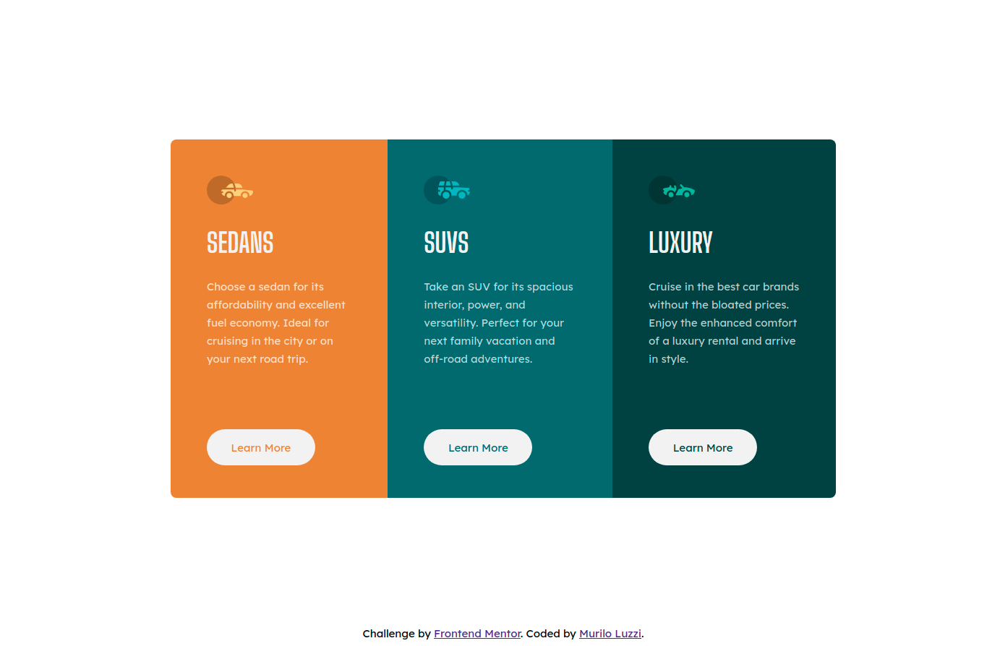

# Frontend Mentor - 3-column preview card component solution

This is a solution to the [3-column preview card component challenge on Frontend Mentor](https://www.frontendmentor.io/challenges/3column-preview-card-component-pH92eAR2-). Frontend Mentor challenges help you improve your coding skills by building realistic projects. 

## Table of contents

- [Overview](#overview)
  - [The challenge](#the-challenge)
  - [Screenshot](#screenshot)
  - [Links](#links)
- [My process](#my-process)
  - [Built with](#built-with)
  - [What I learned](#what-i-learned)
  - [Continued development](#continued-development)
- [Author](#author)

## Overview

### The challenge

Users should be able to:

- View the optimal layout depending on their device's screen size
- See hover states for interactive elements

### Screenshot

### Links

- Solution URL: https://mlzzi.github.io/3-column-preview-card-component-main/

## My process

### Built with

- Semantic HTML5 markup
- CSS custom properties
- Flexbox

### What I learned

This is my first project using CSS Flexbox. It were a wonderful experience. Positioning and building up the layout was increasingly easier than using common CSS properties like float, inline and block.

### Continued development

Now my next step is to learn and apply CSS Grid. This will be a funny journey. As the time pass by and I learn and apply this new knowledge I like more and more Front End Development.

## Author

- Linkedin - https://www.linkedin.com/in/muriloluzzi/
- Frontend Mentor - [@mlzzi](https://www.frontendmentor.io/profile/mlzzi)

